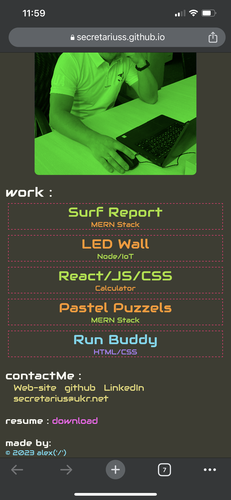
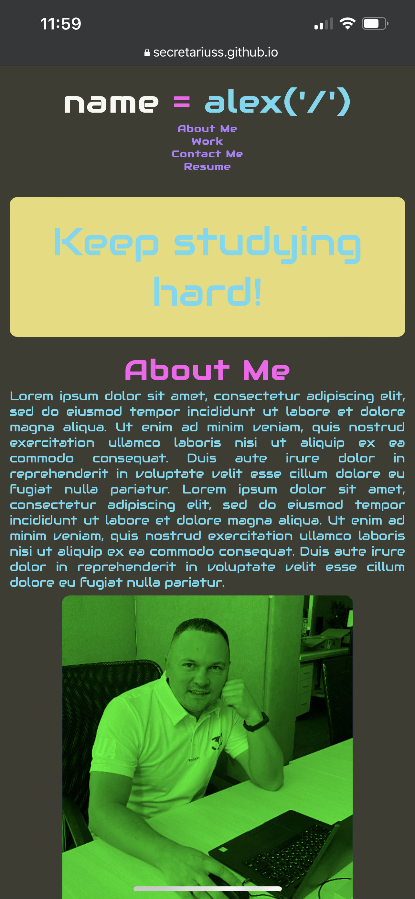
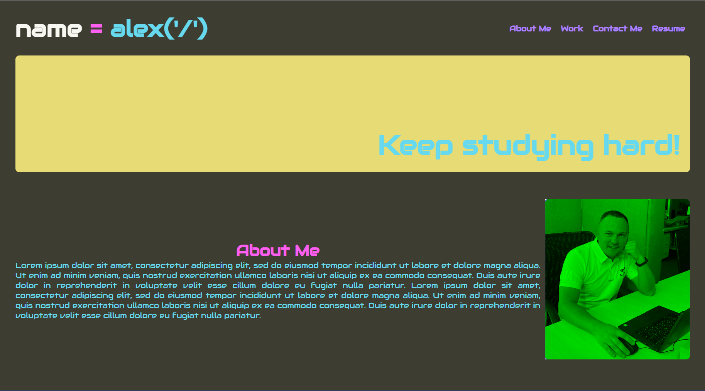
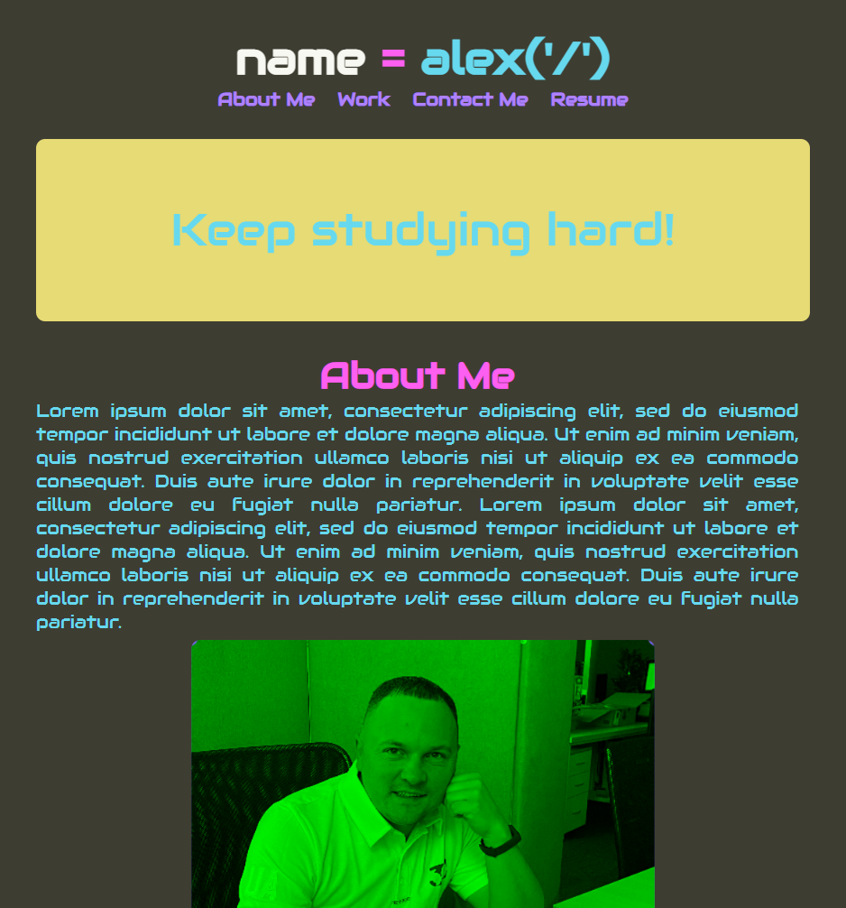
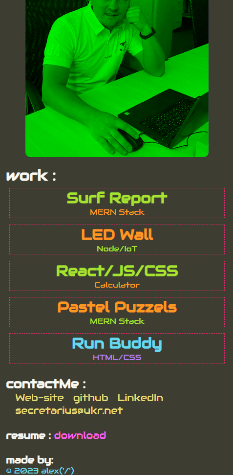

# 02 Advanced CSS: Portfolio

## User Story

AS AN employer
I WANT to view a potential employee's deployed portfolio of work samples
SO THAT I can review samples of their work and assess whether they're a good candidate for an open position

## Description

The portfolio presented with popular monokai theme IDE colors, with the developer's name, 
a recent photo or avatar, and links to sections about them, their work, and how to contact them
When click one of the links in the navigation the UI scrolls to the corresponding section. 
When click on the link to the section contact following links redirect to the next source.
The page is resizeble and view the site on various screens and devices with a responsive layout 
that adapts to some viewports.

## Gitpage reference

https://secretariuss.github.io/professional-portfolio/

## Screen shots

The following scrshots shows the web application's:

